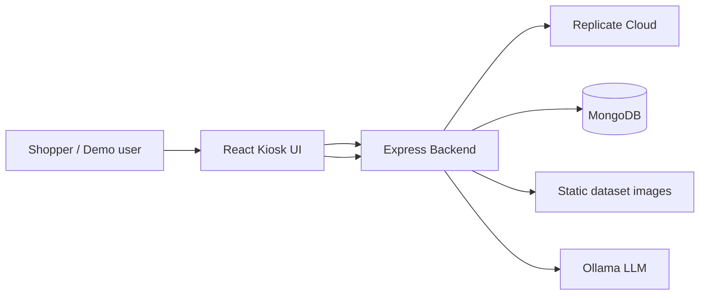
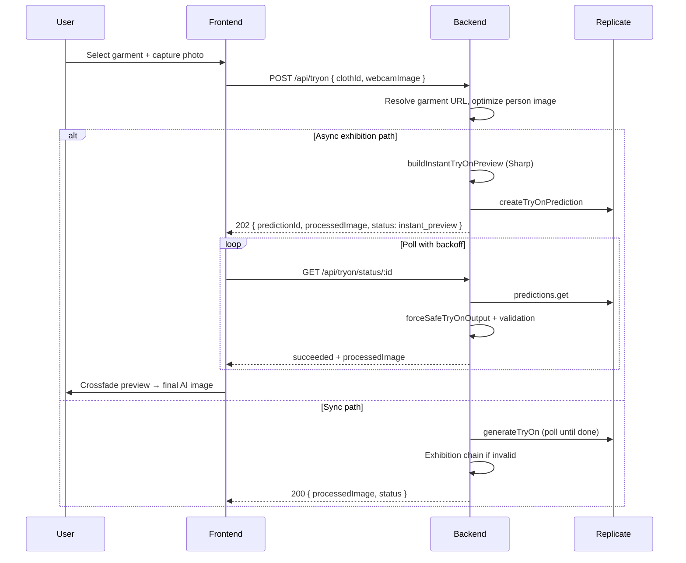

# Smart Mirror AI Virtual Try-On System  
## Full Technical Documentation (Thesis / Final Year Project)

**Document version:** 1.0  
**Project repository:** `smart-mirror`  
**Stack:** React (Vite) · Node.js (Express) · MongoDB · Replicate · Sharp · TensorFlow.js (MoveNet) · Optional ComfyUI · Optional Ollama  

---

## Document control

| Item | Detail |
|------|--------|
| Purpose | Complete technical reference for thesis submission, viva, and maintenance |
| Audience | Examiners, supervisors, developers |
| Scope | End-to-end architecture, implementation, reliability design, APIs, configuration |

---

## Abstract

This project implements an **interactive smart mirror kiosk** for **virtual garment try-on**. A user browses a digital catalog, captures a live webcam photo, and receives a **single composite image** that approximates wearing the selected garment. The system targets **retail exhibitions** and **in-store demos**, where downtime, long GPU queues, and inconsistent model outputs are unacceptable.

The solution combines **cloud-based diffusion try-on models** (CATVTON-Flux and IDM-VTON via Replicate) with a **multi-layer deterministic fallback chain** (optional ComfyUI bridge, MoveNet pose-guided Sharp compositing, and center-overlay Sharp compositing). A strict **image validation layer** ensures the API never returns empty, corrupt, or semantically wrong images (e.g. raw garment-only or unchanged person frames) when exhibition mode is enabled.

The frontend provides a **guided kiosk flow** with **async prediction polling**, **instant Sharp preview**, **session isolation** (stale prediction rejection, prediction locking), and **exhibition mode** tuned for public demos. The backend exposes REST APIs for catalog, try-on, and an optional **Ollama-powered stylist assistant**.

**Keywords:** virtual try-on, smart mirror, Replicate, CATVTON, IDM-VTON, exhibition fallback, Sharp compositing, pose estimation, kiosk UI, session isolation.

---

## Table of contents

1. [Introduction](#1-introduction)  
2. [Problem statement and objectives](#2-problem-statement-and-objectives)  
3. [Related work and technology choices](#3-related-work-and-technology-choices)  
4. [Requirements analysis](#4-requirements-analysis)  
5. [System architecture](#5-system-architecture)  
6. [Implementation](#6-implementation)  
7. [AI models and inference pipeline](#7-ai-models-and-inference-pipeline)  
8. [Fallback and reliability design](#8-fallback-and-reliability-design)  
9. [Frontend kiosk application](#9-frontend-kiosk-application)  
10. [Backend services and APIs](#10-backend-services-and-apis)  
11. [Data management](#11-data-management)  
12. [Security and deployment considerations](#12-security-and-deployment-considerations)  
13. [Challenges, solutions, and engineering decisions](#13-challenges-solutions-and-engineering-decisions)  
14. [Testing and validation strategy](#14-testing-and-validation-strategy)  
15. [Limitations and future work](#15-limitations-and-future-work)  
16. [Conclusion](#16-conclusion)  
17. [Appendices](#17-appendices)  

---

## 1. Introduction

### 1.1 Background

Virtual try-on (VTON) uses computer vision and generative models to visualize how a garment might look on a person without physical fitting. Commercial interest has grown in **smart mirrors**—large touch displays with cameras that let shoppers preview outfits in stores or at events.

Running state-of-the-art VTON in production is difficult because:

- Neural inference is **slow and queue-dependent** on shared GPU clouds.
- Model outputs are **not guaranteed** to be valid try-on composites.
- Kiosk software must handle **many sequential users** without cross-session UI corruption.

### 1.2 Project summary

The Smart Mirror project is a **full-stack web application**:

- **Frontend:** React single-page kiosk (`frontend/`) with catalog browsing, camera capture, result display, and optional AI stylist dock.
- **Backend:** Express server (`backend/`) orchestrating catalog resolution, image preprocessing, Replicate predictions, local compositing, and validation.
- **Data:** MongoDB for garment metadata; static PNG assets under `frontend/public/dataset/`.
- **AI:** Primary path through **Replicate**; secondary local paths through **Sharp**, **MoveNet**, and optionally **ComfyUI**.

### 1.3 Intended users and deployment context

| Context | Usage |
|---------|--------|
| Retail flagship store | Shoppers try outfits on a floor-standing mirror |
| Trade show / exhibition | Short sessions; network and GPU variability |
| Lab / college demo | Development with mock catalog when MongoDB is offline |

---

## 2. Problem statement and objectives

### 2.1 Problem statement

Design a smart mirror system that:

1. Accepts a **live person image** and a **catalog garment image**.
2. Produces a **plausible try-on result** within acceptable demo latency.
3. **Never breaks the kiosk UI** with null images, wrong images, or session bleed from prior users.
4. Operates when **cloud AI is slow or fails**, using deterministic fallbacks.

### 2.2 Functional objectives

| ID | Objective |
|----|-----------|
| F1 | Browse garments by gender/category with images from catalog API |
| F2 | Capture webcam frame and send to server as normalized `data:image` URL |
| F3 | Run virtual try-on (cloud and/or local fallbacks) |
| F4 | Show **instant preview** while async AI runs |
| F5 | Poll async prediction until success or failure |
| F6 | Display **one final processed image** on the result screen |
| F7 | Optional stylist text suggestions via Ollama |

### 2.3 Non-functional objectives

| ID | Objective |
|----|-----------|
| NF1 | **Reliability:** bounded worst-case output (fallback chain + validation) |
| NF2 | **Session safety:** stale async jobs must not overwrite new sessions |
| NF3 | **Operability:** environment-driven model selection (CATVTON vs IDM-VTON) |
| NF4 | **Security:** API tokens and HF tokens server-side only |
| NF5 | **Demonstrability:** exhibition mode hides failure-heavy UX |

---

## 3. Related work and technology choices

### 3.1 Virtual try-on approaches

| Approach | Description | Role in this project |
|----------|-------------|----------------------|
| **Image-based VTON (IDM-VTON)** | Conditions generation on human + garment images | Primary Replicate model family (`cuuupid/idm-vton`) |
| **Diffusion / Flux try-on (CATVTON)** | Higher-quality generative transfer | Optional primary when HF token configured |
| **2D compositing** | Overlay garment on person photo | Instant preview + last-resort fallback |
| **Pose-guided compositing** | Align garment using body keypoints | Exhibition fallback L3 |
| **Workflow engines (ComfyUI)** | Node graphs for custom local pipelines | Optional L2 when `ENABLE_COMFYUI` is set |

### 3.2 Why Replicate

- Provides hosted **version-pinned** models without maintaining local GPU training infrastructure.
- Standard **prediction create + poll** API fits kiosk async UX.
- Trade-off: **queue latency** and **non-deterministic** wall-clock time.

### 3.3 Why Sharp (Node)

- Fast **CPU-side** image decode, resize, rotate, alpha composite.
- Deterministic latency suitable for **instant preview** and **guaranteed output**.

### 3.4 Why TensorFlow.js MoveNet (CPU)

- Single-person pose keypoints for **shoulder/torso alignment** without CUDA on the kiosk server.
- Trade-off: lower geometric fidelity than full 3D body models.

---

## 4. Requirements analysis

### 4.1 Actor diagram (conceptual)



### 4.2 Primary use case: complete try-on session

1. User selects gender → browses catalog → picks garment.  
2. User enters camera step; webcam captures still frame.  
3. Frontend posts try-on request with `clothId` + `webcamImage`.  
4. Backend returns instant preview (async path) or final image (sync path).  
5. Frontend polls prediction until Replicate succeeds.  
6. Validated AI image replaces preview; user views result and may start **new outfit**.

### 4.3 Data requirements

- **Person image:** `data:image/jpeg|png|webp;base64,...` (normalized server-side).  
- **Garment image:** HTTPS URL resolvable by backend and ideally by Replicate (LAN URLs inlined to base64 before cloud call).  
- **Catalog record:** `clothId` (Mongo ObjectId or dev numeric id) → `imageUrl` path.

---

## 5. System architecture

### 5.1 Layered architecture

```text
┌─────────────────────────────────────────────────────────────┐
│  Presentation: React + Vite + Tailwind (Kiosk UI)           │
├─────────────────────────────────────────────────────────────┤
│  API Client: axios (tryonApi, aiApi)                        │
├─────────────────────────────────────────────────────────────┤
│  Application: Express routes + controllers                  │
├─────────────────────────────────────────────────────────────┤
│  Domain services:                                           │
│    tryOnInferenceService, replicateService, comfyTryOnService│
│    ollamaService, catalog resolution                        │
├─────────────────────────────────────────────────────────────┤
│  Image / ML utilities:                                      │
│    normalizeWebcamImage, optimizePersonImageForReplicate,   │
│    tryOnFinalImageValidator, tryOnExhibitionFallbackChain,  │
│    tryOnDemoComposite, tryOnSmartPoseOverlay, catvtonPrepare│
├─────────────────────────────────────────────────────────────┤
│  Infrastructure: MongoDB, static /dataset, env config       │
└─────────────────────────────────────────────────────────────┘
```

### 5.2 End-to-end processing flow



### 5.3 Repository structure

```text
smart-mirror/
├── backend/
│   ├── server.js                 # Express app entry
│   ├── controllers/tryonController.js
│   ├── routes/                   # tryon, catalog, ai, replicate health/debug
│   ├── services/                 # replicate, inference, comfy, ollama
│   ├── utils/                    # composites, validation, pose, metrics
│   ├── models/Cloth.js
│   ├── config/                   # env, loadEnv
│   └── scripts/                  # catalog import, replicate test
├── frontend/
│   ├── src/
│   │   ├── pages/Home.jsx        # Main kiosk state machine
│   │   ├── components/flow/      # Camera, result steps
│   │   ├── components/kiosk/     # Action dock, stylist
│   │   ├── api/                  # tryonApi, aiApi
│   │   └── lib/                  # exhibition guards, mode flags
│   └── public/dataset/           # Garment PNG assets
├── dataset/                      # Legacy optional static tree
└── docs/
    └── THESIS_SMART_MIRROR_DOCUMENTATION.md  # This document
```

---

## 6. Implementation

### 6.1 Backend entry (`server.js`)

- Loads environment via `config/loadEnv.js` and `config/env.js`.
- Middleware: CORS, JSON body limit **25 MB** (large base64 photos).
- Static hosting: `/dataset` → `frontend/public/dataset`; optional legacy `/images`.
- Routes mounted under `/api/tryon`, `/api/catalog`, `/api/ai`, `/api/replicate`, `/api/debug`.
- MongoDB connection is **non-blocking** for HTTP start; mock catalog when DB unavailable (configurable).

### 6.2 Try-on controller (`controllers/tryonController.js`)

**Responsibilities:**

1. Validate `clothId` and `webcamImage`.
2. Normalize webcam to data URL (`normalizeWebcamImage`).
3. Optimize person image for Replicate (`optimizePersonImageForReplicate` — Sharp resize/JPEG).
4. Resolve garment:
   - Mongo `ObjectId` → `Cloth` document → absolute `garmentImageUrl`.
   - Dev numeric id → embedded `DEV_NUMERIC_CATALOG` map.
5. Branch:
   - **Async Replicate** when token configured + person data URL + garment HTTPS URL → HTTP **202** with `predictionId`, `previewImage`, `processedImage`, `status: instant_preview`.
   - Else **`runTryOnInference`** sync path → HTTP **200**.

**Status normalization for client:**

```javascript
// ok → success, passthrough → fallback
normalizeClientTryOnStatus(s)
```

### 6.3 Inference boundary (`services/tryOnInferenceService.js`)

Single entry for ML routing:

| Priority | Condition | Behavior |
|----------|-----------|----------|
| 1 | `AI_TRYON_SERVICE_URL` set | POST remote worker `/tryon` |
| 2 | `REPLICATE_API_TOKEN` + person + garment | `generateTryOn` |
| 3 | Person only + exhibition fallback enabled | `resolveExhibitionFinalImage` without cloud |
| 4 | Person + garment mock | Returns garment as processed (dev without Replicate) |
| 5 | No person | Garment passthrough |

This isolates controllers from Replicate API details.

### 6.4 Replicate service (`services/replicateService.js`)

**Key functions:**

| Function | Purpose |
|----------|---------|
| `resolveModelRef()` | Pinned `owner/model:digest`; CATVTON vs IDM defaults |
| `buildTryOnPayload()` | CATVTON or IDM inputs; inlines non-public garment URLs |
| `createTryOnPrediction()` | Async job, registers metrics |
| `getTryOnPredictionState()` | Poll + `forceSafeTryOnOutput` on success |
| `generateTryOn()` | Sync poll loop with exponential backoff |
| `forceSafeTryOnOutput()` | Normalize output → exhibition chain |

**Model selection logic:**

- `REPLICATE_TRYON_MODEL` overrides defaults.
- `REPLICATE_TRYON_PRIMARY=catvton|idm-vton` when model unset.
- CATVTON requires `REPLICATE_CATVTON_HF_TOKEN` (or aliases); missing token → automatic IDM-VTON fallback for that request.

**Polling:**

- Exponential delay: 1s → 2s → 4s → 8s → max 10s per iteration.
- Overall deadline: `REPLICATE_TRYON_TIMEOUT_MS` (default 420000 ms).

### 6.5 Exhibition fallback chain (`utils/tryOnExhibitionFallbackChain.js`)

Ordered resolution in `resolveExhibitionFinalImage(replicateCandidate, person, garment)`:

| Step | Layer | Condition |
|------|-------|-----------|
| L1 | Replicate candidate | Passes `isValidFinalTryOnImage` (+ heuristic when both inputs present) |
| L2 | ComfyUI | `ENABLE_COMFYUI` + bridge/direct configured |
| L3 | Pose + Sharp | `createExhibitionFallbackImage` (MoveNet optional) |
| L4 | Sharp center composite | `createDemoComposite` |
| L5 | Placeholder PNG | Tiny neutral `data:image/png` if all else invalid |

Logs: `[FALLBACK FLOW]`, `[FINAL IMAGE SELECTED]`.

### 6.6 Image validation (`utils/tryOnFinalImageValidator.js`)

Rejects:

- Empty / too-short strings.
- Invalid base64 payloads in data URLs.
- Output **equivalent** to person or garment URL (passthrough failure).
- Optional `looksLikePersonWearingCloth` heuristic when validating Replicate output with both references.

### 6.7 Instant preview (`buildInstantTryOnPreview`)

Uses `createDemoComposite(person, garment)` for HTTP 202 responses so the mirror shows a composite **before** GPU completes.

### 6.8 ComfyUI service (`services/comfyTryOnService.js`)

- **Not required in production** by default.
- `ENABLE_COMFYUI` must be true for any execution.
- **Bridge mode (preferred):** `COMFY_TRYON_BRIDGE_URL` POST `{ personImage, clothImage }`.
- **Direct mode:** `COMFYUI_TRYON_DIRECT` + workflow JSON file with `__PERSON_IMAGE__` / `__CLOTH_IMAGE__` placeholders.

### 6.9 Pose overlay (`utils/tryOnSmartPoseOverlay.js`)

- TensorFlow.js **CPU** backend.
- MoveNet **SINGLEPOSE_LIGHTNING**.
- Detects shoulders/hips → rotates/scales garment → Sharp `multiply` blend.
- On failure, delegates to `createDemoComposite`.

### 6.10 Demo composite (`utils/tryOnDemoComposite.js`)

- Fetches `data:` or `https:` images into buffers (guards empty buffers).
- Resizes person (max width 1024), overlays garment at torso band.
- `inlineNonPublicHttpUrlForExternalApi`: converts localhost/LAN garment URLs to base64 data URLs for Replicate workers.

### 6.11 Prediction metrics (`utils/tryOnPredictionMetrics.js`)

In-memory map per `predictionId`:

- Poll count, status transitions (debug), terminal cleanup.
- Prevents unbounded growth by deleting context on terminal states.
- Feeds optional model comparison stats (`tryOnModelComparison.js`).

---

## 7. AI models and inference pipeline

### 7.1 CATVTON-Flux (Replicate)

- Default base: `mmezhov/catvton-flux` with pinned digest in code.
- Requires Hugging Face token for FLUX licence gating.
- Preparation via `utils/catvtonPrepare.js` (mask/person JPEG pipeline).
- Env tuning: width, height, steps, guidance scale, seed.

### 7.2 IDM-VTON (Replicate)

- Default base: `cuuupid/idm-vton`.
- Inputs: `human_img`, `garm_img`, `category` (`upper_body` | `lower_body` | `dresses`).
- Category inferred from catalog text when not set in env.

### 7.3 Output normalization

Replicate returns varying shapes (string, array, nested objects). `extractTryOnResultImageUrl` walks preferred keys (`output`, `result`, `image`, etc.) and skips known input field names (`garm_img`, `human_img`, …).

### 7.4 Person image optimization

`optimizePersonImageForReplicate` uses Sharp to cap dimensions and JPEG quality before upload, reducing payload size and queue pressure.

---

## 8. Fallback and reliability design

### 8.1 Design principle

> **Cloud AI optimizes quality; local fallbacks optimize availability and demo continuity.**

### 8.2 Failure taxonomy

| Failure type | Symptom | Mitigation |
|--------------|---------|------------|
| Queue / cold start | `starting` for long periods | Instant preview + async polling; optional starting-abort env (legacy docs) |
| Timeout | `TIMEOUT` error | Exhibition chain in `generateTryOn` catch path |
| Bad output shape | Parse errors | `resolveExhibitionFinalImage(null, …)` |
| Semantic invalid URL | Same as garment/person | Validator + chain |
| Empty Sharp buffer | Process crash | `tryBufferFromImageRef`, placeholder PNG |
| LAN garment URL | Replicate cannot fetch | Base64 inlining |
| Stale async completion | Wrong user sees old outfit | Frontend `dropStalePrediction`, locks, abort controllers |

### 8.3 `forceSafeTryOnOutput` contract

When `TRY_ON_EXHIBITION_COMPOSITE_FALLBACK` is enabled (default true):

1. Try normalize Replicate output.
2. If invalid, pass `null` candidate into `resolveExhibitionFinalImage`.
3. Throw only if chain cannot produce any valid image.

---

## 9. Frontend kiosk application

### 9.1 Technology

- **React 18**, **Vite 5**, **Tailwind CSS 3**, **Axios**.
- Single main page: `pages/Home.jsx` (kiosk state machine).
- Catalog context: `catalog/CatalogContext.jsx`.

### 9.2 UI flow steps

Typical `step` values in `Home.jsx`:

| Step | User experience |
|------|-----------------|
| `gender` | Choose men/women |
| `browse` | Scroll/select garment from rail |
| `preview` | Garment on mirror stage |
| `camera` | Webcam + countdown capture |
| `result` | Try-on result / AI processing |

### 9.3 Exhibition mode (`lib/exhibitionMode.js`)

- `VITE_EXHIBITION_MODE` (default **true** in code if unset).
- Effects include: reduced blocking loaders, silent recovery polling, hiding outfit chrome on final result (`hideOutfitContext`), optional suppression of error panels.

### 9.4 Session isolation (`lib/tryOnExhibitionGuards.js`)

| Mechanism | Purpose |
|-----------|---------|
| `activePredictionId` / `dropStalePrediction` | Ignore late responses from prior sessions |
| `tryLockTryOnFinalImage` | First valid final URL wins per prediction |
| `resetTryOnFinalImageLocks` | New outfit / reset |
| `cleanupExpiredLocks` | Long-running kiosk memory hygiene |
| `aiRevealNonce` + `tryOnPredictionId` | Controlled crossfade preview → AI in `FlowResultStep` |
| `AbortController` on poll | Cancel loop when user navigates away |

### 9.5 Polling strategy (frontend)

- Mirrors backend exponential backoff: `getExponentialPollDelayMs`.
- HTTP timeout **600000 ms** on try-on axios calls (`tryonApi.js`).
- Recovery polling path when main loop aborts early (exhibition).

### 9.6 Key components

| Component | Role |
|-----------|------|
| `FlowResultStep.jsx` | Mirror stage: preview, final image, reveal animation |
| `AutoWebcamCapture.jsx` | Camera capture pipeline |
| `KioskActionDock.jsx` | Flip view, new outfit, stylist entry |
| `MirrorAIStatusOrb.jsx` | Processing visual state (hidden when final image in exhibition) |
| `StylistDockModule` | Calls Ollama stylist API |

---

## 10. Backend services and APIs

### 10.1 Try-on API

#### `POST /api/tryon`

**Request body (JSON):**

| Field | Type | Required | Description |
|-------|------|----------|-------------|
| `clothId` | string \| number | Yes | Mongo ObjectId or dev numeric id |
| `webcamImage` | string | No* | Data URL or base64 image (*required for real try-on) |
| `gender` | string | No | Catalog hint |
| `category` | string | No | Garment region hint for IDM-VTON |
| `mode` | string | No | Reserved / meta |

**Responses:**

| Code | When | Body highlights |
|------|------|-----------------|
| 200 | Sync inference complete | `processedImage`, `originalImage`, `status` |
| 202 | Async Replicate started | `predictionId`, `previewImage`, `processedImage`, `status: instant_preview` |
| 400 | Invalid input | `message` |
| 404 | Unknown cloth | `message` |
| 502/503/504 | AI failures | `message` |

**Client `status` values (normalized):** `success`, `fallback`, `instant_preview` (async initial).

#### `GET /api/tryon/status/:predictionId`

Query: `startedAt` (optional, ms timestamp).

| `status` | Body |
|----------|------|
| `starting` / `processing` | Progress metadata, no image |
| `succeeded` | `processedImage` (validated) |
| `failed` / `canceled` | `error` message |

Alias route: `GET /api/tryon/predictions/:predictionId`.

### 10.2 Catalog API

#### `GET /api/catalog/items`

Query parameters: `gender`, `category`, `q`, `limit` (max 100), `offset`.

Returns `{ items, total }` from MongoDB or embedded mock list when DB offline.

### 10.3 AI stylist API

#### `POST /api/ai/stylist`

Body: `{ prompt, gender?, category? }`  
Response: `{ result: string }`  
Uses **Ollama** (`OLLAMA_BASE_URL`, `OLLAMA_MODEL`). Returns safe fallback text if Ollama unreachable (HTTP 200).

### 10.4 Health / debug

- `GET /api/replicate/health-test` — Replicate connectivity probe.
- `GET /api/debug/replicate` — Optional debug route when `REPLICATE_DEBUG_ROUTE=true`.

### 10.5 Legacy endpoint

- `GET /api/clothes` — Filesystem-scanned nested gender/category image lists (legacy dataset tree).

---

## 11. Data management

### 11.1 MongoDB schema (`models/Cloth.js`)

| Field | Type | Description |
|-------|------|-------------|
| `name` | String | Display name |
| `gender` | String | e.g. `men`, `women` |
| `category` | String | e.g. shirts, outerwear |
| `imageUrl` | String | Path such as `/dataset/men/tops/....png` |
| `tags` | [String] | Optional |
| `price` | Number | Optional |
| `timestamps` | auto | `createdAt`, `updatedAt` |

Images remain on disk; database stores **metadata + URL path**.

### 11.2 Static assets

Primary inventory: `frontend/public/dataset/` served at `/dataset/...`.

### 11.3 Catalog import

Script: `backend/scripts/importCatalog.js` — bulk load into MongoDB from dataset layout.

---

## 12. Security and deployment considerations

### 12.1 Secrets (server only)

| Variable | Must not appear in frontend |
|----------|----------------------------|
| `REPLICATE_API_TOKEN` | Yes |
| `REPLICATE_CATVTON_HF_TOKEN` | Yes |
| `MONGO_URI` | Yes |

Frontend only needs `VITE_API_BASE_URL`.

### 12.2 Input limits

- JSON 25 MB cap for large webcam payloads.
- Validation of image ref format before Replicate calls.

### 12.3 Deployment topology (recommended)

```text
[Kiosk Browser] → HTTP → [Node backend :5000]
                              ├→ MongoDB Atlas / local
                              ├→ Replicate HTTPS API
                              ├→ Optional Comfy bridge on LAN
                              └→ Optional Ollama on localhost
```

Use HTTPS reverse proxy in production; set `trust proxy` already enabled on Express.

### 12.4 Running the project

**Backend:**

```bash
cd backend
cp .env.example .env   # fill REPLICATE_API_TOKEN, MONGO_URI, etc.
npm install
npm start
```

**Frontend:**

```bash
cd frontend
cp .env.example .env   # VITE_API_BASE_URL=http://127.0.0.1:5000
npm install
npm run dev
```

---

## 13. Challenges, solutions, and engineering decisions

### 13.1 AI / cloud

| Challenge | Solution |
|-----------|----------|
| Stuck in `starting` | Async pattern + instant Sharp preview; exponential polling |
| Long GPU queues | Exhibition UX; optional timeout → local chain |
| Inconsistent output JSON | `extractTryOnResultImageUrl` + defensive parsing |
| Wrong semantic output | `isValidFinalTryOnImage` + full fallback chain |

### 13.2 Backend

| Challenge | Solution |
|-----------|----------|
| Sharp empty buffer crash | Buffer length checks; `tryBufferFromImageRef` |
| localhost garment not visible to Replicate | `inlineNonPublicHttpUrlForExternalApi` |
| Invalid API responses | `forceSafeTryOnOutput` always chains in exhibition mode |

### 13.3 Frontend

| Challenge | Solution |
|-----------|----------|
| Garment shown instead of try-on | Exhibition result UI; `hideOutfitContext` |
| Preview vs final confusion | `aiRevealNonce`, dual-layer crossfade |
| Stale prediction updates | `dropStalePrediction`, abort prior poll |
| Duplicate final apply | `tryLockTryOnFinalImage`, URL dedupe ref |

### 13.4 System

| Challenge | Solution |
|-----------|----------|
| Session bleed | Prediction id binding per session |
| Memory growth on long kiosk run | Periodic lock/activity map cleanup |
| Comfy not installed at demo site | `ENABLE_COMFYUI` gate; skip L2 safely |

---

## 14. Testing and validation strategy

### 14.1 Manual test matrix (recommended for thesis appendix)

| # | Test case | Expected |
|---|-----------|----------|
| 1 | Valid Replicate token + both images | Final AI or validated composite |
| 2 | Replicate offline / invalid token | Fallback composite or graceful error |
| 3 | Async 202 path | Instant preview then poll success |
| 4 | Rapid “new outfit” | No stale image from previous prediction |
| 5 | Mongo offline + mock catalog | Catalog loads; numeric cloth ids work |
| 6 | Invalid webcam payload | HTTP 400 |
| 7 | Missing clothId | HTTP 400 |

### 14.2 Backend scripts

| Script | Command |
|--------|---------|
| Replicate smoke test | `npm run test:replicate` (in backend) |
| Image URL verify | `npm run verify:images` |

### 14.3 Observability

Production-oriented log families:

- `[TRYON]` — prediction lifecycle
- `[FALLBACK FLOW]` — layer attempts
- `[FINAL IMAGE SELECTED]` — chosen source

Enable `TRY_ON_FLOW_DEBUG=true` for verbose Replicate payload logging (server only).

---

## 15. Limitations and future work

### 15.1 Current limitations

1. **Replicate dependency** — requires internet, account credits, tolerates queue variance.  
2. **2D fallbacks are not true physics-based draping** — acceptable for demos, not replacement for high-end VTON research systems.  
3. **Pose model accuracy** — single-person, lighting-dependent; weak poses skip to L4.  
4. **ComfyUI** — powerful but operationally heavy; intentionally optional.  
5. **Single-node metrics** — prediction context maps are in-process memory (not clustered).  

### 15.2 Future enhancements

- On-device ONNX / TensorRT VTON for offline boutiques.  
- Garment segmentation masks (SAM / human parsing) for better compositing.  
- User profiles and history (privacy-compliant).  
- Multi-garment layering (jacket over shirt).  
- Centralized observability (OpenTelemetry, structured logs).  
- A/B model comparison dashboard (extend `tryOnModelComparison.js`).

---

## 16. Conclusion

The Smart Mirror AI Try-On system demonstrates how to **productize** research-grade virtual try-on APIs for real-world kiosks. The core contribution is not only integrating CATVTON and IDM-VTON via Replicate, but engineering a **reliability envelope**: validation, ordered fallbacks, instant previews, and session-safe async UI behavior.

For exhibition and retail deployments, **perceived uptime of the mirror experience** matters more than raw model fidelity. By treating invalid model outputs as expected events and routing them through deterministic Sharp and pose pipelines, the system delivers a **continuous user-visible result** suitable for thesis evaluation and operational demos.

---

## 17. Appendices

### Appendix A — Environment variables (backend)

| Variable | Purpose |
|----------|---------|
| `PORT` | HTTP port (default 5000) |
| `MONGO_URI` | MongoDB connection string |
| `USE_MOCK_CATALOG_WHEN_DB_UNAVAILABLE` | Serve embedded catalog if DB down |
| `REPLICATE_API_TOKEN` | Replicate authentication |
| `REPLICATE_TRYON_MODEL` | Model ref `owner/name:version` |
| `REPLICATE_TRYON_PRIMARY` | `catvton` or `idm-vton` when model unset |
| `REPLICATE_TRYON_VERSION` | Version digest if model has no colon |
| `REPLICATE_CATVTON_HF_TOKEN` | HF token for CATVTON |
| `REPLICATE_TRYON_HUMAN_FIELD` / `GARMENT_FIELD` | IDM field names |
| `REPLICATE_TRYON_CATEGORY` | Default garment region |
| `REPLICATE_TRYON_TIMEOUT_MS` | Poll deadline |
| `TRY_ON_EXHIBITION_COMPOSITE_FALLBACK` | Enable exhibition chain (default true) |
| `TRY_ON_SMART_POSE_OVERLAY` | Enable MoveNet path (default true) |
| `TRY_ON_POSE_MAX_SIDE` / `TRY_ON_POSE_MIN_SCORE` | Pose tuning |
| `ENABLE_COMFYUI` | Gate Comfy execution |
| `COMFY_TRYON_BRIDGE_URL` | HTTP bridge for Comfy |
| `COMFYUI_TRYON_DIRECT` / `COMFYUI_TRYON_WORKFLOW_FILE` | Direct Comfy queue |
| `AI_TRYON_SERVICE_URL` | External worker override |
| `TRY_ON_FLOW_DEBUG` | Verbose server logs |
| `OLLAMA_BASE_URL` / `OLLAMA_MODEL` | Stylist LLM |

See `backend/.env.example` for the full commented list.

### Appendix B — Environment variables (frontend)

| Variable | Purpose |
|----------|---------|
| `VITE_API_BASE_URL` | Backend origin |
| `VITE_EXHIBITION_MODE` | Kiosk demo UX |
| `VITE_TRY_ON_FLOW_DEBUG` | Browser console debug |
| `VITE_TRYON_FALLBACK_MS` | Fallback illusion timing |

### Appendix C — HTTP status mapping (try-on client)

| Backend inference `status` | Normalized client `status` |
|--------------------------|----------------------------|
| `ok` | `success` |
| `passthrough` | `fallback` |
| `success` | `success` |
| Async initial | `instant_preview` |

### Appendix D — Module dependency graph (try-on path)

```text
tryonController
  → normalizeWebcamImage, optimizePersonImageForReplicate
  → createTryOnPrediction / runTryOnInference
       → replicateService → resolveExhibitionFinalImage
            → comfyTryOnService (optional)
            → tryOnSmartPoseOverlay → tryOnDemoComposite
            → tryOnFinalImageValidator
```

### Appendix E — Suggested thesis chapter mapping

| Thesis chapter | Sections in this document |
|----------------|---------------------------|
| Introduction | §1, §2 |
| Literature survey | §3 |
| Analysis & design | §4, §5 |
| Implementation | §6, §7, §8, §9, §10 |
| Testing | §14 |
| Results & discussion | §13, §15 (empirical results to be filled by author) |
| Conclusion | §16 |

### Appendix F — Figures for thesis (export suggestions)

1. **System context diagram** — §5.2 sequence diagram (export from Mermaid).  
2. **Fallback layer diagram** — §8 table as layered figure.  
3. **UI flow screenshot set** — gender → browse → camera → result.  
4. **API sequence** — §5.2.  

---

*End of document.*
